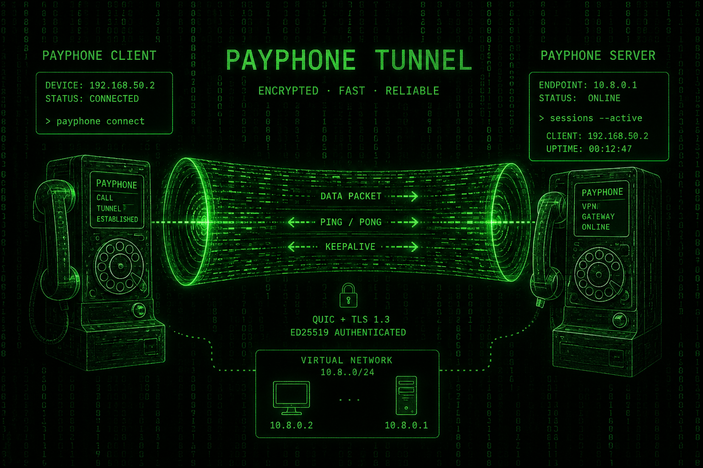

# PAYPHONE



PAYPHONE is an experimental IPv4 VPN written in Rust. It carries IP packets from a TUN interface inside QUIC datagrams, protects the transport with TLS 1.3, and authenticates new sessions with Ed25519-signed subscription tokens.

> [!WARNING]
> PAYPHONE is a development prototype, not a production-ready VPN. It currently uses localhost-only networking, self-signed development TLS credentials, in-memory session state, and incomplete policy enforcement.

## What works

- Bidirectional IPv4 packet transport between TUN interfaces
- QUIC datagrams with TLS 1.3, powered by [Quinn](https://github.com/quinn-rs/quinn)
- Compact, versioned binary frames with strict length validation
- Ed25519-signed subscription tokens with validity periods and plan metadata
- Server-side checks for signatures, activation time, expiry, signing key, and revocation
- Capability negotiation during the initial handshake
- Logical sessions with addresses from `10.77.0.0/24`
- Session resumption after a QUIC reconnect
- Periodic `PING`/`PONG` keepalives
- Source-address validation for packets received from clients
- Concurrent client handling with Tokio
- Full-tunnel routing: the server enables IPv4 forwarding + NAT for the tunnel subnet, and the client overrides its default route through the TUN interface (macOS and Linux), so connected clients get real internet access, not just reachability to the server

## Workspace

| Crate | Purpose |
| --- | --- |
| `payphone-core` | Wire frames, protocol messages, codecs, constants, and validation |
| `payphone-auth` | Subscription claims, Ed25519 signatures, key rings, and token verification |
| `payphone-token` | CLI for generating signing keys and issuing subscription tokens |
| `payphone-transport` | QUIC endpoints and development TLS identity management |
| `payphone-tun` | Async TUN creation and IPv4 header helpers |
| `payphone-server` | Authentication, session management, TUN routing, and QUIC server |
| `payphone-client` | Authenticated VPN client, TUN forwarding, keepalive, and resume logic |

## Requirements

- Rust 1.85 or newer (Rust 2024 edition)
- macOS or Linux with TUN support
- Permission to create and configure TUN interfaces
- Local UDP port `40404` available

The current zero-configuration demo is best suited to macOS because the OS assigns separate `utunN` names automatically. On Linux, both binaries request an interface named `payphone0`; running both on one host therefore requires network namespaces or a code/configuration change.

## Quick start

All commands must be run from the repository root. Runtime files are resolved relative to the current working directory.

### 1. Build the workspace

```bash
cargo build --workspace
```

### 2. Create a development subscription

Generate an Ed25519 key pair and issue a 30-day Pro token:

```bash
cargo run -p payphone-token -- setup 30 pro
```

This creates:

```text
auth-keys/subscription-private.key  # issuer secret; never give it to clients
auth-keys/subscription-public.key   # loaded by the server
subscription.token                 # loaded by the client
```

### 3. Start the server

TUN creation may require elevated privileges:

```bash
sudo ./target/debug/payphone-server
```

The server:

- listens on `127.0.0.1:40404`;
- creates `dev-certs/payphone-cert.der` and `dev-certs/payphone-key.der` when needed;
- creates the server TUN interface at `10.77.0.1/24`;
- loads `auth-keys/subscription-public.key` with key ID `1`.

### 4. Start the client

In another terminal:

```bash
sudo ./target/debug/payphone-client
```

The client reads `subscription.token`, authenticates, receives an address beginning with `10.77.0.2`, creates its TUN interface, and starts forwarding packets. From a third terminal, try:

```bash
ping 10.77.0.1
```

Press `Ctrl+C` to stop either process.

### 5. Test session resumption

Stop only the client and start it again within 30 seconds while the server remains running:

```bash
sudo ./target/debug/payphone-client
```

The client stores a 48-byte session ID/resume-token pair in `.payphone-session`. If the session is still active and the subscription has not expired, the server restores the same logical session and VPN address. A server restart or 30 seconds of inactivity invalidates the saved session.

To force a new authenticated handshake, delete `.payphone-session` before starting the client.

## Docker / remote deployment

The `Dockerfile` builds `server`, `client`, and `token` images from the same multi-stage build. Locally, `docker-compose.yml` runs server + client + a one-off token issuer together.

For a **remote server deployment** (e.g. behind a PaaS like Coolify), use `docker-compose.server.yml` instead of a platform's generic "port mapping" UI/API field. Many such tools default to TCP-only port publishing and either reject a `/udp` suffix outright or silently drop it — `docker ps` then shows the port as merely *exposed*, not actually published (`40404/udp` instead of `0.0.0.0:40404->40404/udp`), and UDP datagrams die at the host's network interface with zero visibility into why. A native Compose `ports: - "40404:40404/udp"` entry doesn't have this problem. Set `PAYPHONE_BIND_ADDR`, `PAYPHONE_OBFS_PSK`, and `PAYPHONE_DEV_MODE` through the platform's own environment variable mechanism.

Because the server's self-signed dev certificate regenerates on every redeploy (it isn't persisted across container restarts), the client's pinned `dev-certs/payphone-cert.der` needs updating after each redeploy. The server logs its own certificate as hex on startup for exactly this purpose — copy that value into the client's `dev-certs/payphone-cert.der`:

```bash
echo <hex from server logs> | xxd -r -p > dev-certs/payphone-cert.der
```

Set `PAYPHONE_DEV_MODE=true` on both sides to log every raw UDP datagram (size + sender) before obfuscation is attempted — useful when diagnosing whether packets are reaching the server at all versus being rejected after arrival. Leave it `false` (the default) otherwise: staying silent toward unrecognized traffic is part of the defense against DPI active-probing (see [Wire obfuscation](#wire-obfuscation)).

## Subscription token tool

Generate a key pair once:

```bash
cargo run -p payphone-token -- init
```

Issue a token using the existing private key:

```bash
cargo run -p payphone-token -- issue <days> <plan>
```

Generate missing keys and issue a token in one command:

```bash
cargo run -p payphone-token -- setup <days> <plan>
```

Available plans currently encode these claims:

| Plan | Device limit | Maximum Mbps |
| --- | ---: | ---: |
| `basic` | 1 | 100 |
| `pro` | 5 | 500 |
| `unlimited` | 255 | 0 (unlimited) |

Tokens are fixed-size 135-byte binary documents. Their signed claims include the key ID, token ID, client ID, issue/activation/expiry timestamps, plan, device limit, and bandwidth limit. Device and bandwidth limits are recorded but not enforced yet.

## Wire obfuscation

Every UDP datagram sent by the client or server is wrapped in a lightweight
obfuscation layer (`payphone_transport::obfuscation`) before it hits the
network, and unwrapped on receive:

```text
[ 8-byte random salt ][ payload XOR tiled SHA256(shared secret || salt) ]
```

This is not encryption — QUIC's own TLS 1.3 already provides
confidentiality and integrity. Its only job is to stop PAYPHONE datagrams
from looking like QUIC on the wire, since QUIC's handshake has a
recognizable byte signature (long header form, version field) regardless
of port. This matters because some DPI middleboxes not only match that
signature passively, but actively probe suspected VPN endpoints — dialing
the IP:port themselves and completing a QUIC handshake to confirm and
blocklist it. A datagram that doesn't decode with the shared secret is
silently dropped before it ever reaches the QUIC layer, so a probe that
doesn't know the secret gets no response at all.

Both sides must be configured with the same secret via `PAYPHONE_OBFS_PSK`
(see `.env.example`). There is no built-in default — the process refuses
to start without it, since a secret compiled into open-source code
provides no real protection against an adversary who can read the
source.

## Protocol overview

Every PAYPHONE message is carried in a QUIC datagram and starts with a 16-byte header:

| Field | Size |
| --- | ---: |
| Protocol version | 1 byte |
| Frame type | 1 byte |
| Flags | 2 bytes |
| Payload length | 4 bytes |
| Sequence number | 8 bytes |

Multi-byte integers use network byte order. Protocol version 1 supports these frame types:

| Value | Frame | Direction | Purpose |
| ---: | --- | --- | --- |
| 1 | `Data` | Both | Carries a session ID, packet ID, and IP packet |
| 2 | `WhatsUpDude` | Client to server | Starts a session and includes the subscription token |
| 3 | `AllGoodDude` | Server to client | Accepts a session and assigns its address and resume secret |
| 4 | `Ping` | Client to server | Keepalive request |
| 5 | `Pong` | Server to client | Keepalive response |
| 6 | `Rekey` | Both | Reserved; not implemented |
| 7 | `Close` | Both | Reserved; not implemented |
| 8 | `BackAgainDude` | Client to server | Requests session resumption |
| 9 | `StillGoodDude` | Server to client | Confirms session resumption |
| 10 | `AccessDeniedDude` | Server to client | Reports token or subscription rejection |

The maximum frame payload and maximum `DATA` payload are both 64 KiB. A handshake authentication token may be at most 2 KiB.

### Data path

```text
Application / kernel
        |
        v
   Client TUN  ->  DATA frame  ->  QUIC + TLS 1.3  ->  Server TUN
   Client TUN  <-  DATA frame  <-  QUIC + TLS 1.3  <-  Server TUN
```

The server maps destination VPN addresses to active sessions. Client-originated IPv4 packets are accepted only when their source address matches the address assigned to that session.

## Testing

Run the complete suite with:

```bash
cargo test --workspace
```

The workspace currently contains 35 passing unit tests covering frames, protocol messages, subscription authentication, session helpers, IPv4 parsing, TLS identity creation, and QUIC endpoint binding. The endpoint test must be allowed to open a local UDP socket.

Formatting can be checked with:

```bash
cargo fmt --all -- --check
```

## Current limitations

- Only IPv4 packets are routed; IPv6 and roaming are advertised by the client but not negotiated by the server.
- The DNS capability bit is negotiated, but DNS configuration is not implemented — the client still uses whatever DNS servers it had before connecting.
- Full-tunnel routing (`payphone_tun::routing`) is only implemented for macOS and Linux; other platforms only reach 10.77.0.0/24.
- `Rekey` and protocol-level `Close` are defined but not implemented.
- Sessions and token revocations are stored only in memory.
- Session sequence numbers are recorded but not currently enforced as an anti-replay mechanism.
- Subscription device and bandwidth limits are not enforced.
- There is no production configuration or command-line interface for addresses, ports, paths, or trusted keys.

## Security notice

The generated TLS certificate is self-signed. The client trusts the certificate file directly, the resume token is stored unencrypted in `.payphone-session`, and the development key paths are local files. Keep `auth-keys/subscription-private.key` secret, do not distribute it with the server or client, and do not use the current credential handling unchanged in production.
